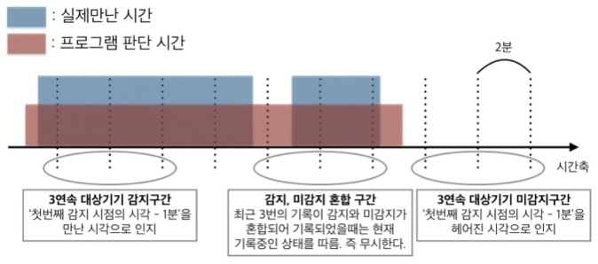
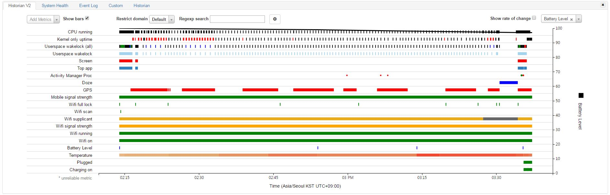
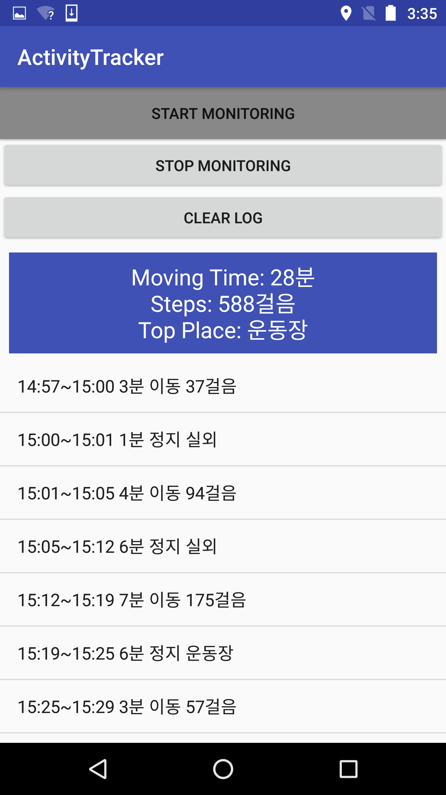

# Mobile System Programming

## 프로젝트 개요

- 팀구성: 개인
- 배터리를 효율적으로 사용하는 모바일 센싱 프로그래밍 (총 3개 어플리케이션)
  - ProximityAlarm: 위치기반 근접 경보 알림 어플리케이션
  - EncounterMonitor: 블루투스를 이용해 특정 사람과 만났던 시간을 기록하는 어플리케이션
  - ActivityTracker: 사용자 활동 모니터링 어플리케이션
- Energy Efficient Sensing을 위한 센싱 알고리즘 설계
- Battery Historian을 이용한 테스팅으로 알고리즘 최적화

### 사용 기술

- JAVA
- Android
- Energy Efficient Sensing

## 1. ProximityAlarm

위치기반 근접 경보 알림 어플리케이션.

사용자는 총 3개의 장소에 대한 근접 경보 알림을 등록할 수 있다.

> 소스코드 내에서 3개 제한 풀면 그 이상도 가능

사용자가 지정된 장소에 들어가거나 벗어나면 토스트 메세지로 이를 알린다.

## 2. EncounterMonitor

블루투스를 이용해 특정 사람과 만났던 시간을 기록하는 어플리케이션.

### 알고리즘

## 3. Activity Tracker

사용자의 활동을 모니터링 하는 애플리케이션.

행동을 정지와 이동으로 구분해 감지하고, 해당 행위를 지속한 시간을 기록함.

이동의 경우 걸음수를 측정함.

정지의 경우 장소를 기록하는데, 실내 2곳과 실외 2곳에 대해 특정 지어 감지할 수 있다.

지정된 4곳의 장소가 아닌경우 실외/실내로 기록한다.

> 조금 더 보완해야함

### Energy Efficient Sensing

1. **Adaptive Duty Cycling**: 움직임을 모니터링하기 위해 가속도 센싱을 하는데 센싱 주기를 상황에 맞게 적절히 조절함.
2. **Conditional Sensing**: 가속도 센서를 이용한 움직임을 모니터링하는 모듈을 통해 이동/정지 상태를 측정하고, 정지시에만 GPS를 이용한 위치 sensing을 함.

#### Battery Historian Graph

### 실행 화면

